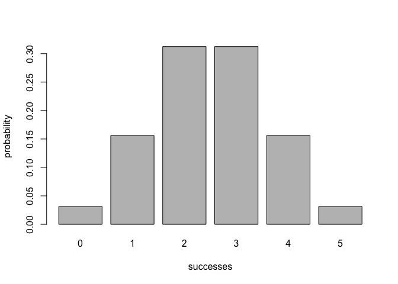
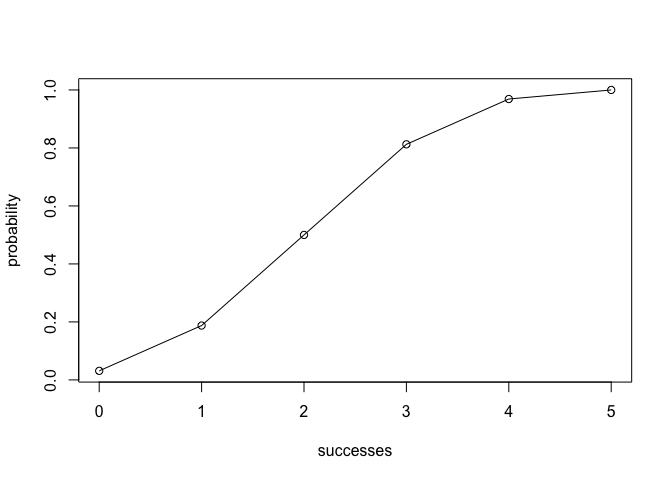

<!-- README.md is generated from README.Rmd. Please edit that file -->
Overview
--------

The [R](http://www.r-project.org/) package `"binomial"` is an implementation for examining and summarizing statistics related to probabilities of number of successes in a fixed number of random independent and identically distributed trials. It also provides relevant visualizations of the binomial distribution.

-   `bin_choose()` calculates the number of combinations of `k` successes in `n` trials.
-   `bin_probability()` calculates the probability of `success` successes in `trials` trials with probability = `prob`.
-   `bin_distribution()` creates a dataframe for the probability of each number of successes with probability = `prob` in `trials` trials. `plot()` show a plot of a binomial probability distribution
-   `bin_cumulative()` creates a dataframe for cumulative probability of each success with probability = `prob` in `trials` trials. `plot()` show a plot of a binomial cumulative distribution.
-   `bin_variable()` generates a binomial random variable object. `summary()` summarizes statistics of a binomial random variable.
-   `bin_mean()` calculates the mean of a binomal distribution.
-   `bin_variance()` calculates the variance of a binomal distribution.
-   `bin_mode()` calculates the mode of a binomal distribution.
-   `bin_skewness()` calculates the skewness of a binomal distribution.
-   `bin_kurtosis()` calculates the kurtosis of a binomal distribution.

Installation
------------

Install the development version from GitHub via the package `"devtools"`:

``` r
# development version from GitHub:
# install.packages("devtools") 
# install "binomial" (without vignettes)
devtools::install_github("stat133-sp19/hw-stat133-christinajin01/binomial")
# install "binomial" (with vignettes)
devtools::install_github("stat133-sp19/hw-stat133-christinajin01/binomial", 
                         build_vignettes = TRUE)
```

Usage
-----

``` r
library(binomial)

# finds number of combinations of 2 successes in 5 trials
bin_choose(5, 2) 
#> [1] 10

# calculates probability of getting 2 successes in 5 trials (assuming prob of success = 0.5) 
bin_probability(2, 5, 0.5)
#> [1] 0.3125

# finds binomial distribution in 5 trials (assuming prob of success = 0.5)
dis1 <- bin_distribution(5, 0.5)
dis1
#>   success probability
#> 1       0     0.03125
#> 2       1     0.15625
#> 3       2     0.31250
#> 4       3     0.31250
#> 5       4     0.15625
#> 6       5     0.03125

# plots binomial probability distribution
plot(dis1)
```



``` r

# finds binomial cumulative distribution in 5 trials (assuming prob of success = 0.5)
dis2 <- bin_cumulative(5, 0.5)
dis2
#>   success probability cumulative
#> 1       0     0.03125    0.03125
#> 2       1     0.15625    0.18750
#> 3       2     0.31250    0.50000
#> 4       3     0.31250    0.81250
#> 5       4     0.15625    0.96875
#> 6       5     0.03125    1.00000

# plots binomial cumulative distribution
plot(dis2)
```



``` r

# generates a binomial random variable object
bin1 <- bin_variable(10, 0.3) 
bin1
#> "Binomial variable"
#> 
#> Parameters
#> - number of trials: 10
#> - prob of success : 0.3

# summarizes the statistics of a binomial random variable
binsum1 <- summary(bin1)
binsum1
#> "Summary Binomial"
#> 
#> Parameters
#> - number of trials: 10
#> - prob of success : 0.3
#> 
#> Measures
#> - mean    : 3
#> - variance: 2.1
#> - mode    : 3
#> - skewness: 0.276026223736942
#> - kurtosis: -0.123809523809524
```

Functions of measures
---------------------

The following functions contain the important statistics of a binomial distrbution for mean, variance, mode, skewness, and kurtosis.

``` r
bin_mean(10, 0.3)
#> [1] 3
bin_variance(10, 0.3)
#> [1] 2.1
bin_mode(10, 0.3)
#> [1] 3
bin_skewness(10, 0.3)
#> [1] 0.2760262
bin_kurtosis(10, 0.3)
#> [1] -0.1238095
```
