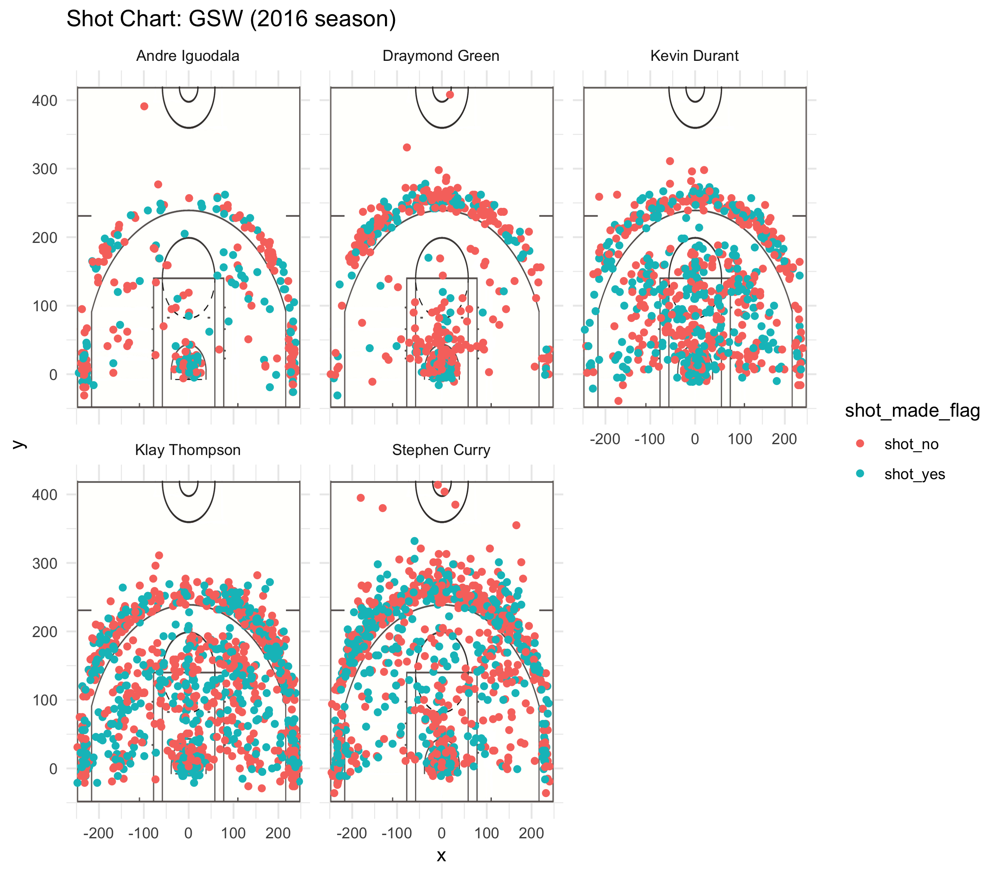

```{r setup, include=FALSE}
knitr::opts_chunk$set(echo = TRUE)
library(dplyr)
```


## Introduction: 

“The Warriors won their fifth NBA Championship, setting the best postseason record in NBA history by going 16-1, ” recorded in Wikipedia. This report is for the purpose of analyzing why Golden State Warriors are able to make such a successful season and where their strength as a team comes from through analyzing the playoff data of 5 of their key players in 2016. Such success is demonstrated by strong individual abilities of team players as well as a diversity of strength which contributes to their overall team work. \


## Motivation:

The success of the GSW in the 2016 season was well-known to the world for their excellent playoff in the pre- and post- season. During the year, the team earned their second most wins in franchise history. Their 16-1 record is the best playoff record in the NBA history, even ousting the 2000–01 Los Angeles Lakers. Thus, this report aims at dissecting several reasons for their success through the point of views of their top players including Andre Iguodala, Draymond Green, Kevin Durant (who they acquired into the team not long ago), Klay Thompson, and Stephen Curry. \


## Background:

During the offseason, GSW acquired the free agent Kevin Durant, and the Warriors were hailed as a “Superteam” by media and fans. The new All-Star “Fantastic Four” of Kevin Durant (PF), Stephan Curry (PG), Klay Thompson (SG), and Draymond Green (PF) was thus formed. Andre Iguodala (SF), "The Sixth Man" of the champion GSW, is also a major force in pushing the team to success.\


## Data:

Here is chart of the shots location in terms of the court of the five players we are analyzing here.\
```{r out.width='80%', echo = FALSE, fig.align='center'}

```

These are the three tables indicating the effective 2- and 3-points each player made. Sections and further analysis of these tables are below. \
```{r echo=FALSE}
data_types = c("team_name"="character", "game_date"="character", "season" = "integer", "period"="integer",
               "minutes_remaining"="integer", "seconds_remaining"="integer", "shot_made_flag"="character",
               "action_type"="factor", "shot_type"="factor", "shot_distance"="integer", "opponent"="character",
               "x"="integer", "y"="integer")
shots <- read.csv("../data/shots-data.csv", stringsAsFactors = FALSE, colClasses = data_types)
effective_2pt <- summarise(group_by(shots[shots["shot_type"]== "2PT Field Goal",], name), total = n(), made = length(which(shot_made_flag == "shot_yes")), perc_made = made/total)
effective_2pt <- arrange(effective_2pt, desc(perc_made))

effective_3pt <- summarise(group_by(shots[shots["shot_type"]== "3PT Field Goal",], name), total = n(), made = length(which(shot_made_flag == "shot_yes")), perc_made = made/total)
effective_3pt <- arrange(effective_3pt, desc(perc_made))

effective_pts = summarise(group_by(shots[(shots["shot_type"]=="2PT Field Goal") | (shots["shot_type"]=="3PT Field Goal"),], name), total = n(), made = length(which(shot_made_flag == "shot_yes")), perc_made = made/total)
effective_pts = arrange(effective_pts, desc(perc_made))
effective_2pt
effective_3pt
effective_pts
```


## Analysis:
**1. Stephen Curry:**
```{r echo=FALSE}
top_n(effective_3pt, 2)
```

Stephen Curry set his personal record of most three-pointers (13) made in a single game in the 2016 season. According to the scatterplot, Steph Curry had the largest percentage of making shots outside the 3-pointer line. **His median shot distance for the season was as large as 23 feet.** As the point guard of the team, he is obviously taking full advantage of his strong mastery of basketball. Making a total of **687 total effective 3-pointer shots**, which was the highest of the team, he **scored around 40% of all the shots he played**. Although such number was not a very high percentage of shots made. He undoubtedly gained the trust of the whole team and was able to make attempts without worrying about getting in or not. Such high attempts of 3-pointers were also a showcase of the emphasis the team had on its team members and the amount of space it gave the team players to showcase their strengths.\

**2. Klay Thompson:**
```{r echo=FALSE}
top_n(effective_3pt, 1)
```
Klay Thompson, coming up second on the total amount of 3-pointer attempts, was also a key 3-point scorer on the team, as the effective 3-point data has shown, has shown very high consistency in his ability of making 3-points, with the highest percentage (**42.4%**) out of all five players we examined in the dataset. \
\
**3. Kevin Durant:**

```{r echo=FALSE}
top_n(effective_pts, 1)
```

Thirdly, Kevin Durant, who was acquired into GSW in the beginning of the season and proved his worth immediately after joining. He was originally known for his field goals, but also showed significant improvement throughout the season in his 3 pointers, climbing up to become the top three 3-pointer shooters on the team. In contrast to the shooting pattern of Steph Curry, we can see from the shot chart that his shots are fairly concentrated within the three-pointer lines. In fact, he has attempted and made the most number of 2-pointers on the team and remained his accuracy of all shots at **more than 50% (highest on the team)**. With his advantage in heights as a forward, he held up the team inside the field, in both offense (shown through data here) and defense. His contribution of the team owned his the MVP of the season at the end, despite his recent joining the team.\
\
**4. Draymond Green:**

Our next player, Draymond Green, carries a large amount of basketball virtues. From the shot chart included in the file, it is obvious to say that he is the most sober-minded player on the team. He was able to provide timely and purposeful passes and defenses to other players of the team. The shot chart shows that his plays are concentrated in positions and he was most comfortable with. Even though he might not be a volume scorer on the team, in fact, his importance on the team is often overlooked, he did not in fact enjoy such name recognition advantage of being the first five starters of GSW.\

**5. Andre Iguodala:**
```{r echo=FALSE}
top_n(effective_2pt, 1)
```

Andre Iguodala, known as “The Sixth Man,” of the team, although not being part of the five starters, was undoubtedly a very important figure of team. He was strong at leading a group of non-starters to defend off the opponents, and giving the starters enough time to rest. As shown from the 2pt effective shot rate table above, he **made 63.8% of all the 2-point shots he attempted**, which is the highest amongst all 5 players, thus proving his ability through precision of shots made. His importance is more significant in the aspect of teamwork. There could never be a successful team without someone like him who was able to contribute to the better good of the team without worrying about personal performance. \


## Conclusion:

It is the overall talents and strengths of individual team players that contributed to the (nearly) undefeated records in its championship history, but this could never make GSW without their diverse strength and personalities. Without the support of Iguodala as a man who holds up the rest of the team to give time for the starters to rest, without Green being the middle man for many successful shots, passes, and points, Durant would never be able to make consecutive points in the field, and Curry and Thompson would never get so many opportunities to make 3-pointer attempts. It is important to keep in mind that, these players, also play as a team, which includes sacrifices of personal fame for the team’s success. Their ultimate goal is the same, for the win of GSW, not themselves, but they benefit from such dedication to their dream, and broke many personal records throughout the season. Their hard work is not selfish and they  could only realize their full potentials while playing as a team and supporting each other along the way. This is why GSW, is able to succeed, together, as well as individually. This report is just a part of their strength, shown through the scoring patterns of each top player on the team, and this is a key component to their eventual success. Their potential, however, is way beyond what these data is demonstrating here, as it resides in their dedication to the team. \


## References:

[Wikipedia](https://en.wikipedia.org/wiki/2016%E2%80%9317_Golden_State_Warriors_season#Regular_season)
